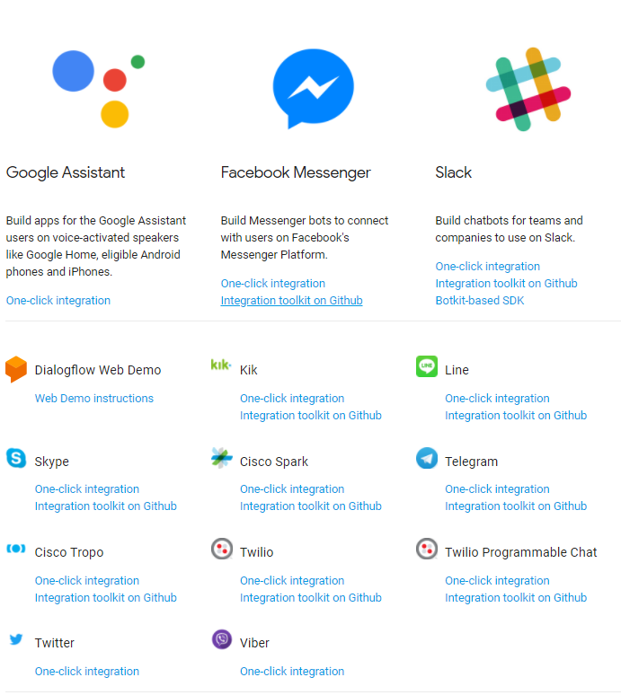
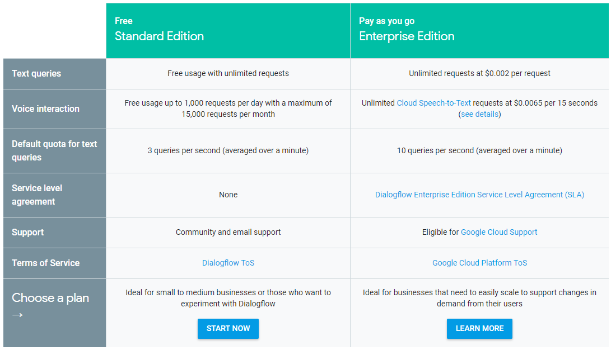

# dialogflow-gcp
DialogFlow와 GCP(Google Cloud Platform)을 이용한 챗봇 테스트

## Dialogflow
###  기본 개념
- 인간과 기계 간의 원활한 의사 소통을 연결해 주는 자연어 처리 기반의 서드 파티 기술
- 머신러닝 기술과 구글의 STT(Speech to text) 기술이 통합

### 활용
- ARS나 인공지능 챗봇
- 음성 인식 기반의 다양한 장치(AI 스피커나 스마트폰 음성 인식 기반 시스템 등)
### 연동 플랫폼

### 가격

